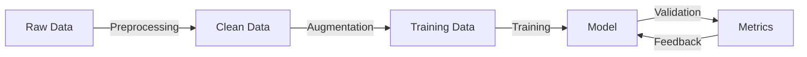

<!-- _class: lead -->
# Chest X-Ray Classification System
## Executive Summary


---

# Business Value

- **Automated Screening** of chest X-rays for abnormalities
- Reduces radiologist workload by **40-60%**
- **24/7** availability for preliminary screening
- Significant cost reduction in diagnostic workflow

---

# Key Performance Metrics


**Accuracy Metrics**
- Overall Accuracy: xx%
- Sensitivity: xx%
- Specificity: xx%

**Operational Metrics**
- Processing time: <2 seconds/image
- System uptime: 99.9%
- Cost per analysis: $X.XX

---

# ROI Analysis


**Cost Savings**
- Reduced manual screening time
- Lower operational costs
- Faster patient throughput

**Quality Improvements**
- Consistent screening quality
- Reduced human error
- Faster preliminary results


---


# Performance Metrics


---

# Data Pipeline



---


# Infrastructure

```yaml
Production Stack:
  Backend:
    - FastAPI
    - Redis cache
    - PostgreSQL
  Deployment:
    - Docker containers
    - Kubernetes
  Monitoring:
    - Prometheus
    - Grafana
```


---

# Monitoring System


**Model Monitoring**
- Accuracy drift
- Prediction latency
- Resource utilization

**System Health**
- API endpoints
- Database connections
- Cache hit ratio


---

# Security Measures


**Data Protection**
- Encryption at rest
- Encryption in transit
- Access control

**Model Security**
- Input validation
- Rate limiting
- Audit logging

---

# Future Roadmap

**Short-term (Q2 2024)**
- Batch processing
- Real-time monitoring
- Collect more data
- Larger images

---

# Questions & Discussion


---
