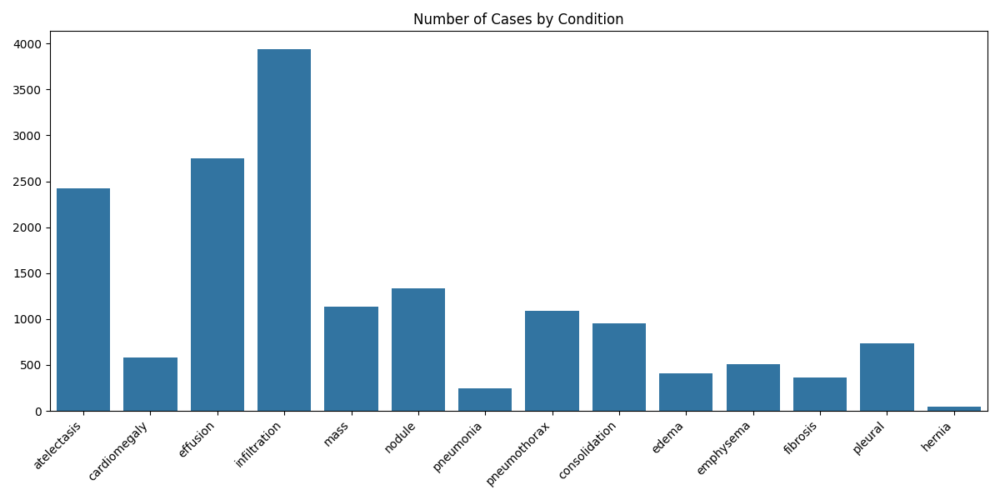
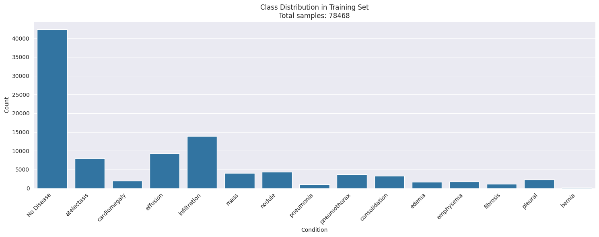
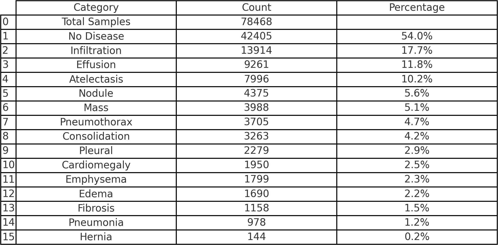
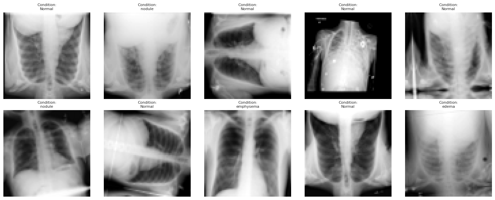

# Deep Learning for Chest X-Ray Classification
## A Technical Implementation with PyTorch Lightning

---

# Project Overview

- Multi-label classification of chest X-rays
- 14 different pathological conditions
- Custom CNN and transfer learning approaches
- MLFlow for full experiment tracking and reproducibility
- ❌ Didn't have time to implement explainable AI techniques
- ❌ Didn't have time to implement hyperparameter optimization
---

# Medical Context

- Chest X-rays: Primary diagnostic tool
- Common conditions detected:
  - Pneumonia
  - Cardiomegaly
  - Edema
  - Pneumothorax
- Critical for rapid diagnosis and triage
---

# Class distribution (unbalanced)


---

# Class Distribution with Normal


---

# Dataset Statistics



---

# Technical Architecture

## Infrastructure
- PyTorch Lightning for training
- MLflow for experiment tracking
- Mixed precision training (FP16)
- GPU acceleration

## Model Design
- Custom CNN architecture
- ResNet transfer learning option
- Early stopping and learning rate scheduling

---

# Training Process

1. Data Pipeline
   - Custom DataModule
   - Augmentation strategies
   - ❌ Class weight balancing (wasn't sure about the best approach)

2. Training Loop
   - Early stopping
   - Learning rate scheduling
   - Metrics monitoring
   - Experiment tracking

---

# Augnementation Strategies

- Preprocessing
  ```python
  transforms = A.Compose([
                    A.RandomRotate90(p=0.5),
                    A.VerticalFlip(p=0.5),
                    A.ShiftScaleRotate(
                        shift_limit=0.1,
                        scale_limit=0.1,
                        rotate_limit=rotate_limit,
                        p=0.5,
                    ),
                    A.RandomBrightnessContrast(
                        brightness_limit=brightness, contrast_limit=contrast, p=0.2
                    ),
                    A.Normalize(mean=[0.5], std=[0.5]),
                    ToTensorV2(),
  ])
  ```

---



---

# Custom CNN Architecture

```python
class ChestNetS(ChestNetBase):
    """
    Simple CNN with three conv blocks and a classifier head. Each convolutional block includes convolution, batch normalization, ReLU activation,
    and max pooling operations. The classifier uses dropout for regularization and fully connected layers for final classification.
    Takes 64x64 grayscale images, outputs 14 binary classifications.
    """
        # Feature extraction backbone
        self.features = nn.Sequential(
            # Block 1: Input (1, 64, 64) -> Output (32, 32, 32)
            nn.Conv2d(1, 32, kernel_size=3, padding=1),
            nn.BatchNorm2d(32),  # Normalize activations for stable training
            nn.ReLU(inplace=True),
            nn.MaxPool2d(2, 2),  # Reduce spatial dimensions by 2x
            
            # Block 2: Input (32, 32, 32) -> Output (64, 16, 16)
            nn.Conv2d(32, 64, kernel_size=3, padding=1),
            nn.BatchNorm2d(64),
            nn.ReLU(inplace=True),
            nn.MaxPool2d(2, 2),
            
            # Block 3: Input (64, 16, 16) -> Output (128, 8, 8)
            nn.Conv2d(64, 128, kernel_size=3, padding=1),
            nn.BatchNorm2d(128),
            nn.ReLU(inplace=True),
            nn.MaxPool2d(2, 2),
        )

        # Classification head
        self.classifier = nn.Sequential(
            nn.Dropout(0.5),  # Prevent overfitting
            nn.Linear(128 * 8 * 8, 512),  # Flatten and project to 512 dimensions
            nn.ReLU(inplace=True),
            nn.Dropout(0.5),  # Additional dropout layer
            nn.Linear(512, 14),  # Final projection to output classes
        )

    def forward(self, x: torch.Tensor) -> torch.Tensor:
        x = self.features(x)  # Extract visual features
        x = torch.flatten(x, 1)  # Flatten spatial dimensions
        x = self.classifier(x)  # Generate classification logits
        return x

```

---

# Resnet Architecture

```python
class ChestNetResnet(ChestNetBase):
    # Input Size Compatibility: The ResNet-18 model is compatible with 64x64 inputs due to the
    # adaptive average pooling layer, which adjusts to varying spatial dimensions.
    # Pretrained Weights Handling: The first convolutional layer's weights are initialized by
    # averaging the pretrained RGB weights, preserving some pretrained features even with grayscale input.
    def __init__(
    ):
        # Load pretrained ResNet-18
        backbone = models.resnet18(pretrained=pretrained)
        # Modify first convolutional layer for grayscale input, 
        original_conv1 = backbone.conv1
        self.backbone = backbone
        self.backbone.conv1 = nn.Conv2d(
            1,  # Input channels changed to 1
            original_conv1.out_channels,
            kernel_size=original_conv1.kernel_size,
            stride=original_conv1.stride,
            padding=original_conv1.padding,
            bias=False,
        )
        # Initialize weights from pretrained model
        if pretrained:
            with torch.no_grad():
                self.backbone.conv1.weight.copy_(
                    original_conv1.weight.mean(dim=1, keepdim=True)
                )
        # Replace final fully connected layer
        in_features = self.backbone.fc.in_features
        self.backbone.fc = nn.Linear(in_features, num_classes)
        # Define feature extractor
        self.features = nn.Sequential(
            self.backbone.conv1,
            self.backbone.bn1,
            self.backbone.relu,
            self.backbone.maxpool,
            self.backbone.layer1,
            self.backbone.layer2,
            self.backbone.layer3,
            self.backbone.layer4,
            self.backbone.avgpool,
        )

    def forward(self, x: torch.Tensor) -> torch.Tensor:
        x = self.features(x)
        x = torch.flatten(x, 1)
        x = self.backbone.fc(x)
        return x

```

---

# Validation Strategy

- Metrics:
  - Multi-label accuracy
  - Precision
  - F1 Score
  - ROC curves
- Cross-validation
- Error analysis

---

# Deployment Readiness

1. Model Serving
   - Optimized inference
   - Version control
   - Monitoring setup

2. Quality Assurance
   - Performance thresholds
   - Safety checks
   - Continuous validation

---

# Future Improvements

1. Architecture Enhancements
   - Attention mechanisms
   - Ensemble methods
   - Advanced augmentation

2. Clinical Integration
   - Workflow optimization
   - Reporting integration
   - Feedback loops

---

# Thank You

## Questions?

Contact: piotr.gryko@gmail.com
